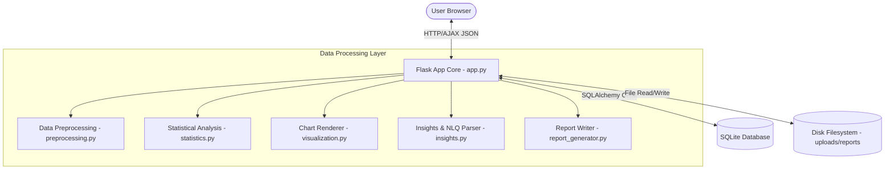
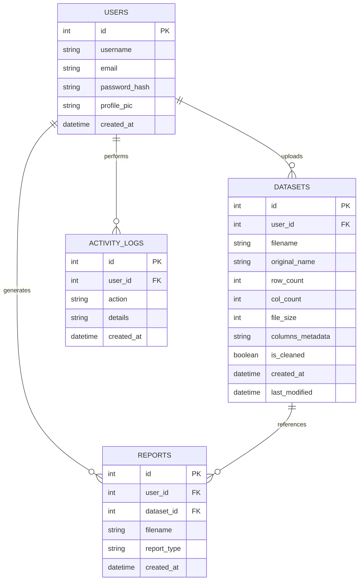
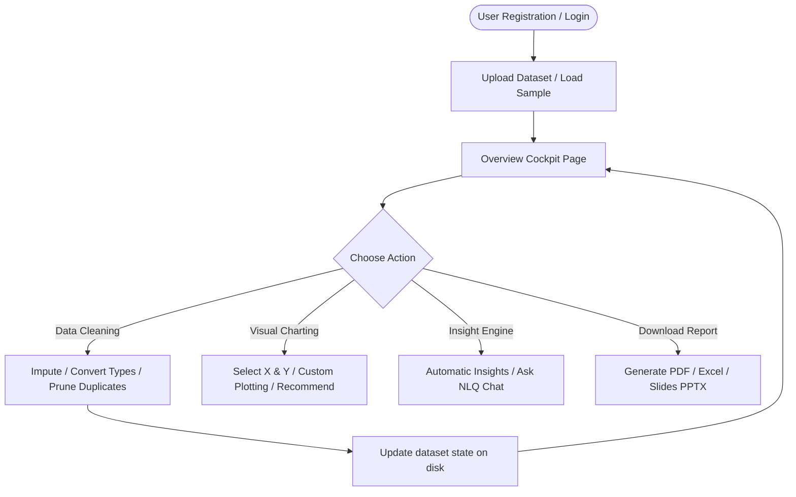

# InsightX – Exploratory Data Analysis Platform

InsightX is an industry-grade, full-featured web platform that automates **Exploratory Data Analysis (EDA)**. It enables users to securely upload structured datasets, examine distributions, clean missing values, identify correlations, ask questions in plain English via a Natural Language Query (NLQ) engine, and download professional reports (PDF, Excel, PowerPoint) — all without writing code.

---

## 🏗️ System Architecture



---

## 📊 Entity Relationship (ER) Diagram



---

## 🔄 User Operations Workflow



---

## 📂 Project Directory Structure

```
InsightX/
├── app.py                     # Main Flask Application
├── config.py                  # Environment & Path Configuration
├── requirements.txt           # Python Project Dependencies
├── seed_data.py               # Seeds Sample Datasets (Titanic, Churn, etc.)
├── README.md                  # Comprehensive Documentation
├── .gitignore                 # Cache & Data Git Ignore rules
├── dataset/                   # Local seed template folder
├── uploads/                   # Stored user datasets (ignored by git)
├── reports/                   # Stored generated reports (ignored by git)
├── exports/                   # Temp exported sheets (ignored by git)
├── models/
│   └── models.py              # SQLAlchemy Schema Models
├── notebooks/
│   └── eda_demo.ipynb         # Python Programmatic API Demo
├── static/
│   ├── css/
│   │   ├── style.css          # Color Variables, Glassmorphism, Toasters
│   │   └── dashboard.css      # Sidebar & Analytics Layout Grids
│   └── js/
│       ├── main.js            # Theme Toggle & Global Toast triggers
│       └── dashboard.js       # AJAX Cleaners, Plotly, NLQ Chat
├── templates/
│   ├── base.html              # Boilerplate structure
│   ├── index.html             # Landing Page
│   ├── login.html             # Login
│   ├── register.html          # Register
│   ├── profile.html           # Settings & Dataset Manager
│   ├── upload.html            # Drag & drop uploader / Demo loader
│   ├── dashboard.html         # Dataset Cockpit Overview
│   ├── analysis.html          # Descriptive Stats & Imputer Table
│   ├── charts.html            # Plotly Charts & Recommender
│   ├── report.html            # Automated Text Insights
│   ├── about.html             # Project details
│   └── contact.html           # Contact
└── utils/
    ├── helpers.py             # File I/O Helpers & Logging
    ├── preprocessing.py       # Imputations & Outlier pruners
    ├── statistics.py          # Variance, Correlations, Skewness
    ├── visualization.py       # Plotly Heatmaps, Matplotlib generators
    ├── insights.py            # Natural Language Parser (NLQ)
    └── report_generator.py    # ReportLab PDF, OpenPyXL Excel, PPTX Slides
```

---

## ⚡ Quick Start & Installation

Follow these steps to configure and boot the application locally.

### 1. Prerequisites
Ensure you have **Python 3.8+** installed.

### 2. Clone and Setup Environment
Navigate to the directory and initialize a virtual environment:
```bash
# Initialize venv
python -m venv venv

# Activate venv (Windows)
venv\Scripts\activate

# Activate venv (Mac/Linux)
source venv/bin/activate
```

### 3. Install Dependencies
Install all package frameworks from `requirements.txt`:
```bash
pip install -r requirements.txt
```

### 4. Seed Datasets & Start Application
Seed the sample databases first, then boot the Flask server:
```bash
# Seed local demo CSV files (Titanic, Student performance, Churn)
python seed_data.py

# Boot Server
python app.py
```
Open **http://127.0.0.1:5000** in your web browser.

---

## 🔒 Security Protocols & Protections

1. **SQL Injection Prevention:** All SQL interactions are performed via SQLAlchemy's parameterized queries (Object Relational Mapper), avoiding raw SQL concatenations.
2. **Cross-Site Scripting (XSS) Mitigation:** Jinja2 automatic escaping prevents malicious code inputs inside text parameters.
3. **Password Security:** All user credentials are encrypted using PBKDF2 salting and hashing protocols (`werkzeug.security`).
4. **Malicious Upload Restrictions:** File uploads are checked against explicit mime-type extensions (`csv`, `xlsx`, `xls`). Max upload size is enforced at `16MB` to avoid denial-of-service attempts.
5. **Secure Sessions:** Sessions are signed using cryptographic signatures utilizing private `SECRET_KEY` variables.

---

## 🐳 Docker Deployment & Containerization

Deploy InsightX instantly using Docker:

### 1. Create a `Dockerfile`
Create a `Dockerfile` in the root folder:
```dockerfile
FROM python:3.9-slim

WORKDIR /app

COPY requirements.txt requirements.txt
RUN pip install --no-cache-dir -r requirements.txt

COPY . .

# Generate sample datasets
RUN python seed_data.py

EXPOSE 5000

ENV FLASK_APP=app.py
ENV FLASK_RUN_HOST=0.0.0.0

CMD ["flask", "run"]
```

### 2. Build and Run Container
```bash
# Build Image
docker build -t insightx-eda .

# Run Container
docker run -p 5000:5000 insightx-eda
```

---

## 🚀 Cloud Deployment Instructions

### Render Deployment
1. Connect your GitHub repository to [Render](https://render.com/).
2. Create a new **Web Service**.
3. Choose environment as `Python`.
4. Build Command: `pip install -r requirements.txt && python seed_data.py`
5. Start Command: `gunicorn app:app` (Make sure to add `gunicorn` to your dependencies if hosting on production Linux environments).
